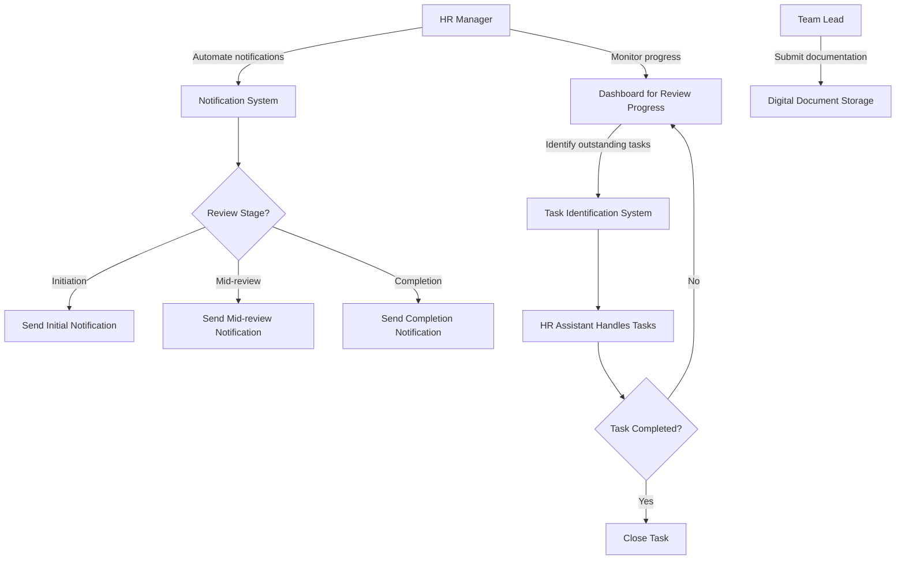
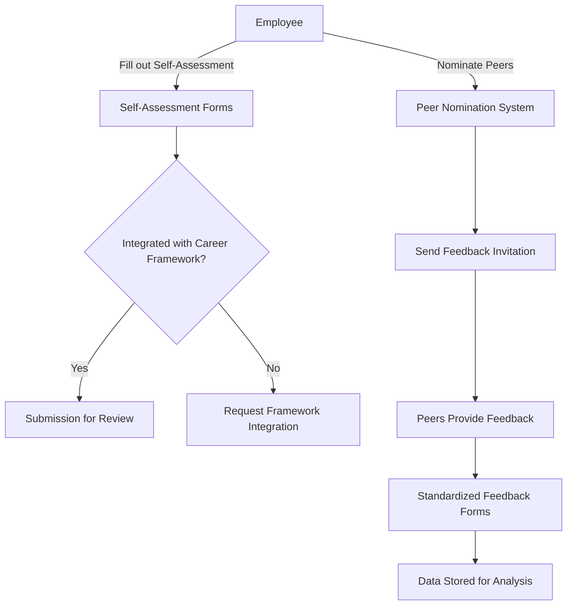
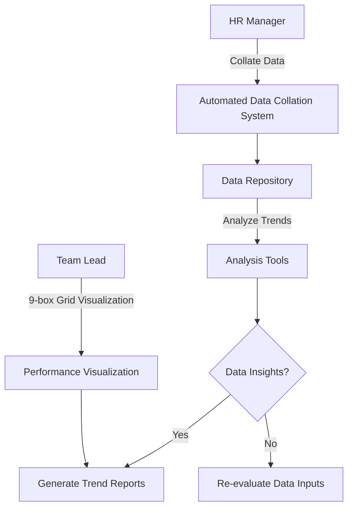
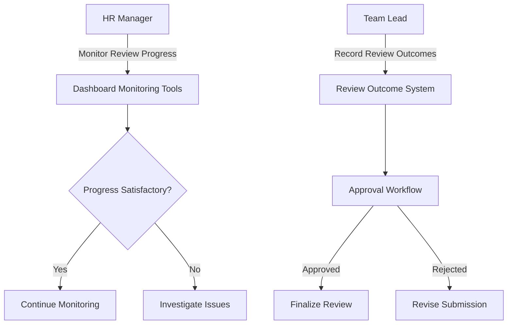
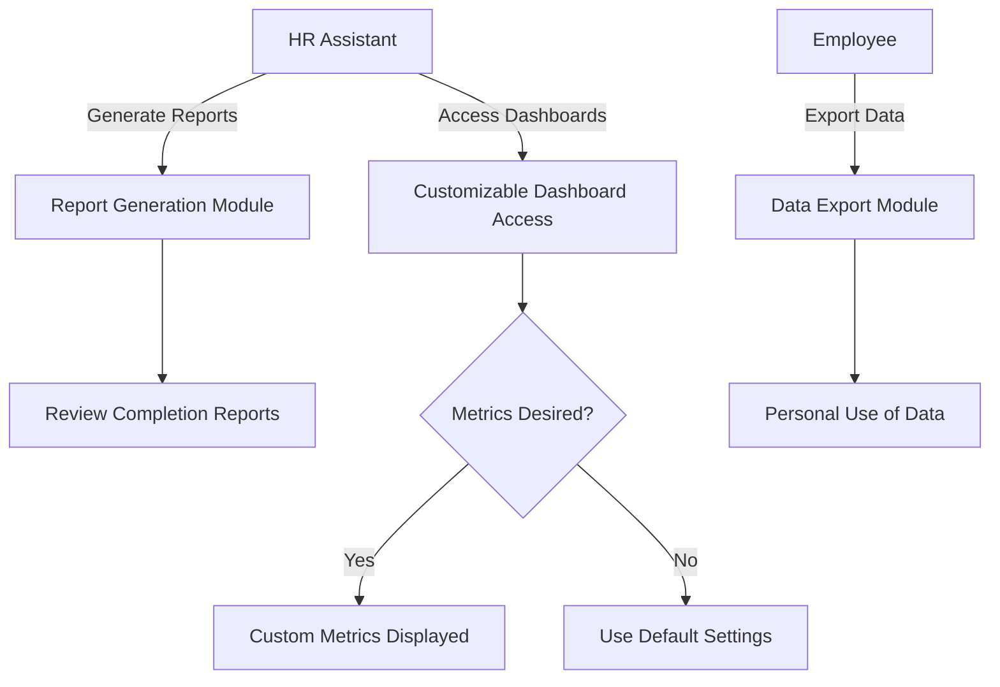
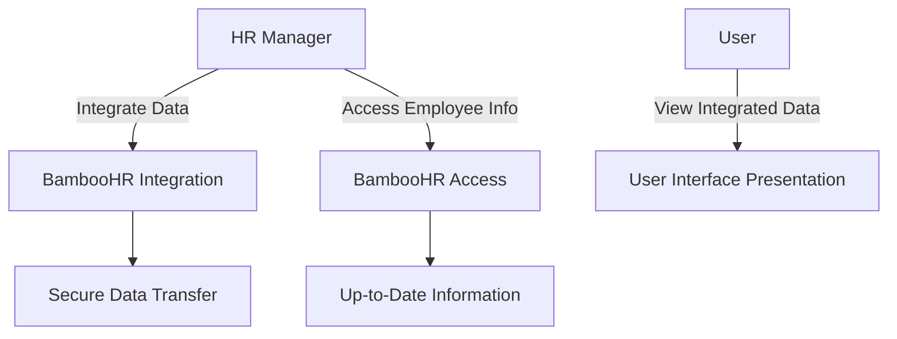
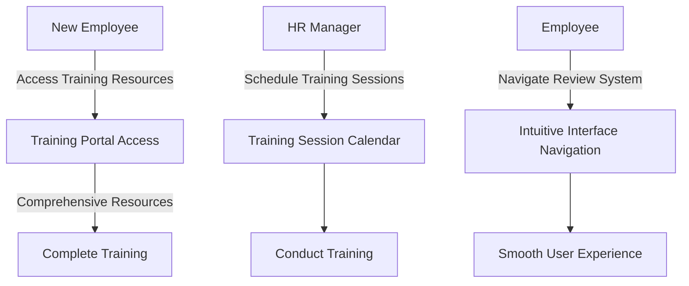

```markdown
### Performance Review Process Automation Flowchart

This diagram outlines the flow for automating notifications, tracking progress, and managing the documentation submission process in the performance review system.



### Self-Assessment and Peer Feedback Flowchart

This flowchart represents the process for employees completing self-assessments and providing peer feedback using standardized forms.



### Data Collation and Analysis Flowchart

This diagram illustrates the process of automatic data collation and usage of analysis tools to identify trends and support decision-making.



### Managerial and HR Monitoring Tools Flowchart

This flow explains how managers and HR personnel can monitor the review processes using dashboards and manage review outcomes.



### Reporting and Analytics Flowchart

This flowchart describes the reporting and analytics capabilities offered by the performance review system.



### Integration with Existing HR Systems Flowchart

This diagram emphasizes the seamless integration of the performance review system with BambooHR and other HR systems.



### User Adoption and Training Flowchart

This flowchart outlines the process for promoting user adoption and training for the performance review system.



With these diagrams, the key user journeys and system interactions within the Performance and Progression Review Software Solution are effectively mapped out, illustrating how each epic and related user stories come together to meet the project goals. This visual representation provides clarity for implementation and adoption planning.